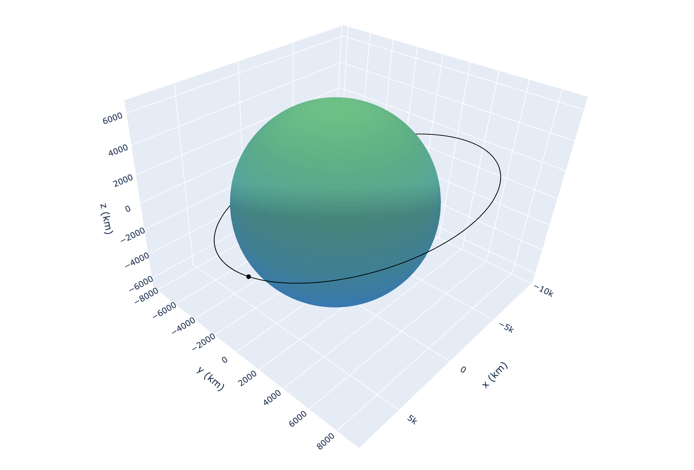

<!-- EllipsePy | Lalith Uriti 2021 -->

<p align="center"></p>

<h1 align="center">EllipsePy</h1>

<h3 align="center">
Orbital Mechanics Data Visualization and Analysis Library
</h3>

<p align="center">

<a href="https://github.com/r-spacex/SpaceX-API/releases">

</a>

<a href="https://en.wikipedia.org/wiki/Representational_state_transfer">

</a>

<a href="https://hub.docker.com/r/jakewmeyer/spacex-api/">

</a>

<a href="https://github.com/r-spacex/SpaceX-API/actions?query=workflow%3ATest">

</a>

</p>

<h3 align="center">

<a href="https://github.com/lalithu/EllipsePy">V1 Docs</a> - <a href="https://pypi.org/project/EllipsePy">PyPI</a> - <a href="https://github.com/lalithu/EllipsePy/issues">Status</a>
<br/>

</h3>

## Installation

```sh
pip install EllipsePy
```

## Requirements

- NumPy

  ```sh
  pip install numpy
  ```

- SciPy

  ```sh
  pip install scipy
  ```

- Plotly
  ```sh
  pip install plotly
  ```

## Examples

_For more examples, please refer to the [Documentation](https://github.com/lalithu/EllipsePy)_

## License

Distributed under the MIT License. See `LICENSE` for more information.

## Contact

Lalith U - [@BlueUnveiling](https://twitter.com/BlueUnveiling) - lalithuriti@gmail.com

Project Links:

- PyPI: [https://github.com/lalithu/EllipsePy-Testing](https://pypi.org/project/EllipsePy/)
- Github: [https://github.com/lalithu/EllipsePy-Testing](https://github.com/lalithu/EllipsePy)
